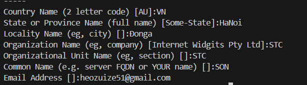

### Create a new private key in the PKCS#1 format
```
openssl genrsa -des3 -out key_name.key key_strength
```
__example__
```
openssl genrsa -des3 -out localhost.key 2048 
```

### Create a certificate signing request (CSR). The request is associated with your private key and is later transformed into a certificate
```
openssl req -new -key path_to_private_key.key -out csr_name.csr
``` 
__example__
```
openssl req -new -key localhost.key -out csr_name.csr
```
